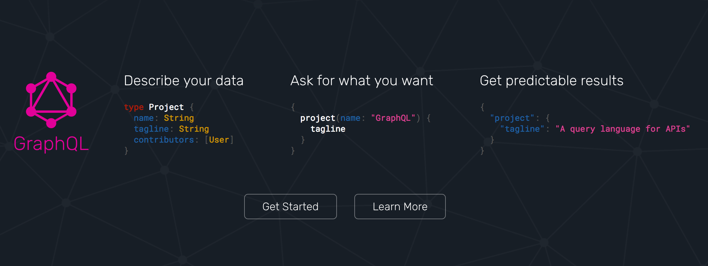
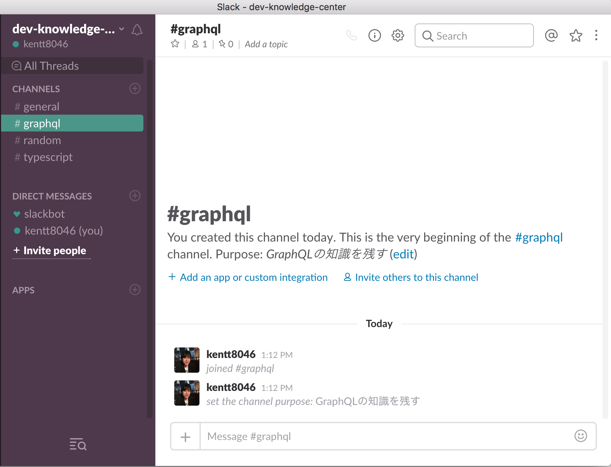

# GraphQL入門

〜RESTに苦しむサーバサイドエンジニアが
救われた話〜



---

## 趣旨

- GraphQLを知る
- RESTとの違いを知る
- 実際の使い方と使いどころを知る

---

## GraphQLとは

- facebookが策定・リファレンス実装している
    - http://graphql.org/
- Web APIの設計及び規約 & 問い合わせのためのクエリ言語
- つまりRESTの親戚

---

## REST

--

- Web APIの設計及び規約
- URLのパスとメソッドでリソースに対する操作を表現する
    - GET       /users      ユーザの取得
    - POST      /users      ユーザの新規作成
    - PATCH     /users/1    IDが1のユーザの情報を変更
    - DELETE    /users/1    IDが1のユーザを削除

--

- あくまでリクエストのインターフェース
    - サーバ側はこのお約束を守って実装する
    - 守ればRESTを知っている人はだいたいわかる
- レスポンス
    - 基本的に対象のリソースをそのまま返す

---

## GraphQL

--

- RESTで言うメソッドは2種類
    - Query
        - リソースを取得する
        - GETに相当
    - Mutation
        - リソースに対する変更
        - POST, PATCH, DELETEに相当

--

- サーバ: リソースを定義

    ```graphql
    schema {
    query: Query,
    mutation: Mutation
    }
    type Query {
        user(): User
        users(): [User]!
    }
    type Mutation {
        signup(args: UserCreateArgs!): User!
        signin(): SigninResult!
    }
    type User {
        id: ID!
        name: String!
        email: String!
        # passwordは取得できてはいけないから定義しない
        friends: [User]!
        createdAt: Int! # GraphQLにDate型はない → 自分で定義できる
        updatedAt: Int!
    }
    type SigninResult {
        user: User!
        token: String!
    }
    input UserSignupArgs {
        id: ID!
        name: String!
        email: String!
        password: String!
    }
    input UserSigninArgs {
        email: String!
        password: String!
    }
    ```

--

- サーバ: リゾルバを実装

    ```js
    const resolvers = {
        User: {
            friends(user, args, ctx, info) {
                const { loader } = ctx;
                return loader.user.loadMany(user.friendIdList);
            }
        },
        Query: {
            user(obj, args, ctx, info) {
                const { db } = ctx;
                const { id } = args;
                return db.user.findById(id);
            },
            users(obj, args, ctx, info) {
                const { db } = ctx;
                return db.user.findAll();
            },
        },
        Mutation: {
            signup(obj, args, ctx, info) {
                let result = /* アカウント作成処理 */
                return result;
            },
            signin(obj, args, ctx, info) {
                let result = /* ログイン判定処理 */
                return result;
            }
        },
    };
    ```

--

- クライアント: クエリを投げる

    ```graphql
    # 1つのリクエストで複数のクエリが投げられる
    query {
        user {
            id
            name
            email
        }
        users {
            ...UserInfo
        }
    }
    # リソースのフィールド指定をまとめることができる
    fragment UserInfo on User {
        id
        name
        email
    }
    ```

---

## 使い方

1. サーバでスキーマに対応する処理(=Resolver)を実装
1. クライアントからリクエストを投げる
    - POST /graphql
    - ボディにクエリを入れる
1. レスポンスからクエリの結果を取り出す

- とっても簡単

> あとでデモします

---

## RESTの問題点

（と個人的に思っていること）

--

### レスポンスの変更に対する影響が大きい

サーバ
> レスポンス修正したから対応よろしく。

クライアント
> こっちで使うデータ構造になっていない。直して。

--

クライアント
> このデータ足りないからレスポンスに足して。

サーバ
> それ時間かかるんでそっちでなんとかしてください。

--

### 使わない項目も取得してしまう

> ネットワーク負荷増大

--

### 複数のリソースが必要な場合

> 何回もリクエストを投げる
>> さらにネットワーク負荷増大

---

## GraphQLなら

--

### レスポンスの変更に対する影響が小さい

> フィールドに対応するリゾルバをいじるだけ

サーバ
> レスポンス修正したから対応よろしく。

クライアント
> この前のスキーマの通りね。おっけー！

--

### 使わない項目は取ってこない

> クエリでいらないフィールドは省ける

--

### 複数のリソースが必要でも問題ない

> 1リクエストで複数のクエリを投げられる

- さらにリソースのネストに対応
    - 友達の友達の・・・でも実装の変更なしでクエリを変えるだけ

        ```graphql
        users {
            friends {
                friends {
                    # ...
                }
            }
        }
        ```

---

## フレームワーク

--

- 大体の言語でサポートされている
- ただし、実装スピードはまちまち

--

- NodeJS https://github.com/apollographql/graphql-server
- Ruby https://github.com/rmosolgo/graphql-ruby
- Java https://github.com/graphql-java/graphql-java
- Python https://github.com/graphql-python/graphene
- PHP https://github.com/webonyx/graphql-php
- Go https://github.com/graphql-go/graphql

--

- やっぱりNodeJSが活発（本家ですから・・・）
- JS以外の言語を使うなら
    - BFF (Backend For Frontend)をNodeJSのGraphQLサーバにする。
    - バックエンドを好きな言語で実装したAppサーバにするといい感じ？
    - サーバ間はgRPCなんか使ったりするとモダンな感じ。
    - でもスキーマ二重管理になるから、JSON-RPCとか？

---

## GraphQLを使う時のアーキテクチャ

--

## GraphQLの特性は

- あらかじめスキーマを定義する
- レスポンスは自動でマッピングしてくれる
- 読み取り(Query)と書き込み(Mutation)で分かれている

--

### あらかじめスキーマを定義する

- リソースをモデリングする
    - 粒度は？
    - データ構造は？
    - データとしての項目とロジック・UIに必要な項目

> DDD (Domain Driven Design)

- ドメイン駆動設計に沿って考える

--

### レスポンスは自動でマッピングしてくれる

- トップレベルのオブジェクトのみを返す
    - ネストするものはIDで引っ張ってくる
    - ORM、リレーショナルデータベースの使い所がない

> NoSQLの採用

- 高度な検索が必要なら
    - 永続化はNoSQL
    - 検索はRDBで併用する

Note:
RDBはボトルネックになりやすい
NoSQLで書き込み/読み込み性能を向上
検索用のRDBは検索項目だけ

--

### 読み取り(Query)と書き込み(Mutation)で分かれている

- QueryとMutationで共通コードはあまりない
    - レスポンス返すとこくらい？
- 書き込み系の処理はとても複雑
    - DDDでコンテキストや依存関係を分けてもなお大変
    - 読み込み系は条件絞ってデータ返すだけ

> CQRS (Command Query Responsibility Segregation)

- コマンドクエリ責務分離とドメイン駆動設計
    - 書き込み系の複雑性をある程度抑えられる

---

## 自分が技術を選択する時の判断基準

--

- 習得コストと採用した時の開発効率のバランス（コスパ）
    - 自分もそうだし、新しいメンバーに教えるときが大変かどうか。
    - 最初はいいけど、規模が大きくなってくるとバケモノになる時がある。

--

- その時点で何を求められているか
    - スタートアップなら実装スピード
    - バージョン2なら実行パフォーマンス & 堅牢性 ＆ 複雑性を抑える
    - 新しいやり方を模索したいか、今のやり方を浸透させたいか

--

- メンバーはどう思うか
    - 新しいもの好きな人
    - 仕事したくない人
    - 結果のみ重視する人
    - etc...

--

- 自分が使っていて楽しいかどうか

--

### 何が言いたいかというと

--

- GraphQLにも欠点（その人にとってダメな部分）はある。
- 実際に使わないで採用すると9割は失敗する。
- メンバーの反対を押し切ってまで採用するのはどうなのか。
- 自分に責任を持って、人の尻拭いまでできるのか。

> 全部理解して採用することが大事

---

## 業務で使って失敗した話

--

### 新規サービス開発で技術選定をしたとき

--

- サーバのフレームワークで何を使うか
    - Express?
    - Sails?
    - KoaJS?
    - GraphQL?

--

- graphqlだけ未知で調査と軽く触ってみた
    - 他のフレームワークでRESTを実装するのと開発コストはあまり変わらなかった
    - レスポンスの形をクライアントが自由に指定できるのは魅力的だった

> GraphQLを採用

--

### GraphQLを採用したのだが・・・

--

- スキーマを書いてリゾルバを実装してコミットの流れで作業
    - リクエスト/レスポンスのデータがクライアントと食い違う
    - -> 修正

--

- クエリのフィールドを全て記述
    - コードの行数がめちゃくちゃ増える

--

- レスポンスを自分で作っていた
    - RESTと同じように自分でレスポンス用のデータ構造に変換していた
    - とあるユーザのコメントにいいねしている人のアカウント名
    - ORMでこのデータ構造は<font color="red">苦しみ</font>しかない

        ```graphql
        {
            user {
                comments {
                    like {
                        users {
                            name
                        }
                    }
                }
            }
        }
        ```
--

- クエリとミューテーション
    - 共通部分とそうでない部分の組み合わせで複雑になっていった
    - 基本的にクエリが単純でミューテーションがややこしかった

--

> GraphQLのデメリット？（+わかってない部分）が見えてきた

--

### なんとかせねば

--

- ~~スキーマを書いてリゾルバを実装してコミットの流れで作業~~
- スキーマを書いてクライアント担当と合意、リゾルバを実装してコミット
    - たたき台のスキーマを書いて仕様を決めた
    - その場でスキーマを編集して合意
    - インターフェースの部分での食い違いがなくなった

--

- ~~クエリのフィールドを全て記述~~
- **Fragment**を使う
    - レスポンスのフィールドをひとまとめにできる機能
    - コードの行数が減って見通しが良くなった

        ```graphql
        fragment UserInfo on User {
            id
            name
            email
        }
        query {
            users {
                ...UserInfo
            }
        }
        ```

--

- ~~レスポンスを自分で作っていた~~
- GraphQLにお任せ
    - レスポンスを返す前にtypeで定義したスキーマ通りに加工するレイヤーがあった
    - トップレベルのオブジェクトさえ返せばあとは勝手にクエリ通りの構造にしてくれる
    - ORMがいらなくなった orz

--

- ~~クエリとミューテーション~~
- Read系とWrite系
    - CQRSの採用
    - DDDはもともと採用していたのでソースコードをquery-stackとcommand-stackに分けた

--

- 旧ディレクトリ抜粋

    ```text
    ./src/server/
    ├─ application
    │   ├─ error
    │   ├─ graphql
    │   │   ├─ resolver
    │   │   └─ type
    │   └─ middleware
    ├─ domain
    │   └─ subdomain
    ├─ infrastructure
    └─ utility
    ```

--

- 新ディレクトリ抜粋

    ```text
    ./src/server/
    ├─ application
    │   ├─ error
    │   ├─ graphql
    │   │   └─ type
    │   └─ middleware
    ├─ command-stack
    │   ├─ application
    │   │   └─ mutation
    │   └─ domain
    │       └─ subdomain
    ├─ infrastructure
    ├─ query-stack
    │   └─ application
    │       ├─ facade
    │       └─ query
    └─ utility
    ```

--

## ついでにWrite系をすっきりさせたい

- RxJSの採用
    - 全てがイベントドリブンになる
    - 1つの処理から分岐できる
        - レスポンスを返す
        - メールを送る
        - WebSocketで通知する
- クリーンアーキテクチャを参考にアーキを組み替え
    - Unidirectional DataFlow
    - 処理の流れが単一方向になる
    - Flux -> Reduxで実現されている

--

### 改善開始してから

- 2ヶ月経っても終わりません笑
    - 通常の機能実装をやりつつ
    - 空いた時間で移行作業
    - 現在の進捗は7割ほど

> 結論: 途中からのアーキ変更はめっちゃ時間かかる (当たり前)

---

## 改善後

--

- GraphQLという共通言語ができて少ないコミュニケーションで作業開始
- クライアントでレスポンスの修正があった時にサーバサイドの変更なしでやってくれた
- 新アーキとGraphQLの組み合わせでコードがわかりやすくなった

--

> GraphQLってたーのしー！


--

> RESTに苦しむサーバサイドエンジニア（私）が救われた

---

## GraphQLまとめ

--

- RESTと比べて
    - ネットワーク負荷低
    - サーバ/クライアントのDX (Developer Experience) が向上

--

- 別ドキュメントの作成がいらない
    - self-documentingな仕様
    - 開発フローの中にスキーマ定義が組み込まれている

--

- アーキテクチャも最適化する
    - DDD
    - NoSQL
    - CQRS
    - Clean Architecture

--

- 開発途中でRESTから乗り換える必要はない
    - リクエスト/レスポンスが変わると全部に影響する
    - アーキテクチャも含めて対処しないと結局大変

--

> GraphQLってたーのしー！


---

## デモ

- https://github.com/kentt8046/node-graphql-todo-sample
- 一緒に質疑応答も受け付けます

---

## 最後に

技術・知識を共有してより良い開発ができることを

目的にしたSlackチームを作りました。



--

- GraphQLについてもっと知りたい
- 最近のフロント業界って？
- この技術いい感じだから誰かに伝えたい

--

などなど、目的に沿って情報交換できる方がいたら

Twitter (@kentt8046) から声かけてくれれば招待します。

一緒にいい開発ライフを送りましょう！

---

## ご静聴ありがとうございました